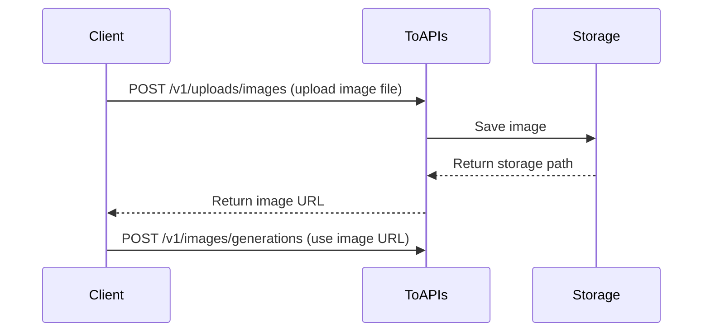

# Upload Image

> Upload images to get URLs for use in image/video generation APIs

<Note>
  **The docs Playground does not support file uploads**: Please use the cURL, Python, or JavaScript code examples below for testing.
</Note>

<Warning>
  **Important Change**: For better performance and cost control, we no longer support passing base64 image data directly in generation APIs. Please use this endpoint to upload images first, then use the returned URL in generation requests.
</Warning>

## Why Upload First?

1. **Performance** - Base64 encoding inflates data by 33%, uploading first significantly reduces request payload size
2. **Reusability** - Upload once, use the URL multiple times without re-transmitting

## Workflow



## Authorizations

<ParamField header="Authorization" type="string" required>
  Use Bearer Token for authentication

  Get your API Key: Visit [API Key Management](https://toapis.com/console/token)

  ```
  Authorization: Bearer YOUR_API_KEY
  ```
</ParamField>

## Body

<ParamField body="file" type="file" required>
  Image file

  **Supported formats:**

  * JPEG (.jpg, .jpeg)
  * PNG (.png)
  * WebP (.webp)
  * GIF (.gif)

  **Limits:**

  * Maximum file size: 10MB
</ParamField>

<ParamField body="purpose" type="string">
  Upload purpose (optional)

  Default: `generation`
</ParamField>

## Response

<ResponseField name="success" type="boolean">
  Whether the request succeeded
</ResponseField>

<ResponseField name="data" type="object">
  <Expandable title="Response data">
    <ResponseField name="id" type="string">
      Upload record ID for tracking
    </ResponseField>

    <ResponseField name="url" type="string">
      Public URL of the uploaded image, can be used directly in generation APIs
    </ResponseField>

    <ResponseField name="mime_type" type="string">
      MIME type of the image, e.g., `image/jpeg`
    </ResponseField>

    <ResponseField name="size" type="integer">
      File size in bytes
    </ResponseField>
  </Expandable>
</ResponseField>

<RequestExample>
  ```bash cURL theme={null}
  curl --request POST \
    --url https://toapis.com/v1/uploads/images \
    --header 'Authorization: Bearer <token>' \
    --form 'file=@/path/to/your/image.jpg'
  ```

  ```python Python theme={null}
  import requests

  # Upload image
  with open('image.jpg', 'rb') as f:
      response = requests.post(
          "https://toapis.com/v1/uploads/images",
          headers={
              "Authorization": "Bearer your-ToAPIs-key"
          },
          files={
              "file": f
          }
      )

  result = response.json()
  image_url = result['data']['url']
  print(f"Image URL: {image_url}")

  # Use the uploaded image for generation
  response = requests.post(
      "https://toapis.com/v1/images/generations",
      headers={
          "Authorization": "Bearer your-ToAPIs-key",
          "Content-Type": "application/json"
      },
      json={
          "model": "gemini-3-pro-image-preview",
          "prompt": "Create a variation based on this image",
          "image_urls": [{"url": image_url}]
      }
  )
  ```

  ```javascript JavaScript theme={null}
  (async () => {
  const fileInput = document.createElement('input');
  fileInput.type = 'file';
  fileInput.accept = 'image/*';
  fileInput.click();
  await new Promise(resolve => fileInput.onchange = resolve);

  // 上传图片（已验证成功）
  const formData = new FormData();
  formData.append('file', fileInput.files[0]);

  const uploadResponse = await fetch('https://toapis.com/v1/uploads/images', {
    method: 'POST',
    headers: {
      'Authorization': 'Bearer your-ToAPIs-key' // 替换为你的实际API密钥
    },
    body: formData
  });

  const uploadResult = await uploadResponse.json();
  const imageUrl = uploadResult.data.url;
  console.log(`图片 URL: ${imageUrl}`);

  // 使用上传的图片进行生成（仅修改image_urls格式，解决400）
  const genResponse = await fetch('https://toapis.com/v1/images/generations', {
    method: 'POST',
    headers: {
      'Authorization': 'Bearer your-ToAPIs-key', // 替换为你的实际API密钥
      'Content-Type': 'application/json'
    },
    body: JSON.stringify({
      model: 'gemini-3-pro-image-preview',
      prompt: '基于这张图片创作变体',
      image_urls: [imageUrl] 
    })
  });

  const genResult = await genResponse.json();
  console.log('生成结果:', genResult);
  })();
  ```
</RequestExample>

<ResponseExample>
  ```json 200 Success theme={null}
  {
    "success": true,
    "message": "",
    "data": {
      "id": "upload_abc12345",
      "url": "https://files.toapis.com/uploads/123/1737568800_abc12345.jpg",
      "mime_type": "image/jpeg",
      "size": 89234
    }
  }
  ```

  ```json 400 Bad Request theme={null}
  {
    "success": false,
    "message": "Unsupported image type. Allowed: JPEG, PNG, WebP, GIF"
  }
  ```

  ```json 400 File Too Large theme={null}
  {
    "success": false,
    "message": "Image too large. Maximum size is 10MB"
  }
  ```
</ResponseExample>

## Complete Example: Image-to-Image Workflow

Here's a complete image-to-image workflow example:

```python Python Complete Example theme={null}
import requests
import time
import os

API_KEY = os.getenv(
    "TOAPIS_API_KEY", "your-ToAPIs-key"
)
BASE_URL = "https://toapis.com"


def _raise_api_error(resp: requests.Response, payload: dict) -> None:
    if resp.ok:
        return
    msg = payload.get("message") or payload.get("error")
    if isinstance(msg, dict):
        msg = msg.get("message") or str(msg)
    raise RuntimeError(f"HTTP {resp.status_code}: {msg or payload}")


def _require_api_key() -> None:
    if not API_KEY:
        raise RuntimeError("缺少 TOAPIS_API_KEY 环境变量")


def upload_image(file_path: str) -> str:
    _require_api_key()
    with open(file_path, "rb") as f:
        resp = requests.post(
            f"{BASE_URL}/v1/uploads/images",
            headers={"Authorization": f"Bearer {API_KEY}"},
            files={"file": f},
        )
    body = resp.json()
    _raise_api_error(resp, body)
    if not body.get("success"):
        raise RuntimeError(body.get("message") or str(body))
    return body["data"]["url"]


def create_generation(image_url: str, prompt: str) -> str:
    _require_api_key()
    resp = requests.post(
        f"{BASE_URL}/v1/images/generations",
        headers={
            "Authorization": f"Bearer {API_KEY}",
            "Content-Type": "application/json",
        },
        json={
            "model": "gemini-3-pro-image-preview",
            "prompt": prompt,
            "image_urls": [image_url],
            "size": "16:9",
        },
    )
    body = resp.json()
    _raise_api_error(resp, body)
    task_id = body.get("id") or body.get("task_id")
    if not task_id:
        raise RuntimeError(f"创建任务响应缺少 id: {body}")
    return task_id


def wait_for_result(task_id: str) -> str:
    _require_api_key()
    while True:
        resp = requests.get(
            f"{BASE_URL}/v1/images/generations/{task_id}",
            headers={"Authorization": f"Bearer {API_KEY}"},
        )
        result = resp.json()
        _raise_api_error(resp, result)

        status = result.get("status")
        if status == "completed":
            r = result.get("result") or {}
            items = r.get("data") or []
            if not items or not items[0].get("url"):
                raise RuntimeError(f"completed 但无 URL: {result}")
            return items[0]["url"]
        if status == "failed":
            err = result.get("error") or {}
            raise RuntimeError(
                f"生成失败: {err.get('message') or result.get('fail_reason') or result}"
            )

        time.sleep(2)


if __name__ == "__main__":
    image_url = upload_image("reference.jpg")
    print(f"✅ 图片已上传: {image_url}")

    task_id = create_generation(image_url, "将这张照片转换为赛博朋克风格")
    print(f"✅ 任务已创建: {task_id}")

    result_url = wait_for_result(task_id)
    print(f"✅ 生成完成: {result_url}")
```
