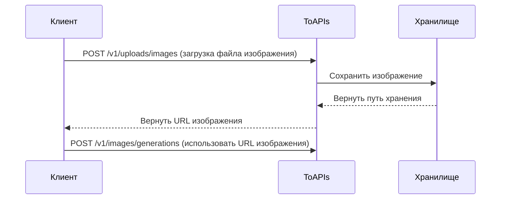

> ## Documentation Index
> Fetch the complete documentation index at: https://docs.toapis.com/llms.txt
> Use this file to discover all available pages before exploring further.

# Загрузка изображения

> Загрузите изображения для получения URL, используемых в API генерации изображений/видео

<Note>
  **Playground документации не поддерживает загрузку файлов**: Пожалуйста, используйте примеры кода cURL, Python или JavaScript ниже для тестирования.
</Note>

<Warning>
  **Важное изменение**: Для повышения производительности и контроля затрат мы больше не поддерживаем передачу данных изображений в формате base64 напрямую в API генерации. Пожалуйста, используйте этот эндпоинт для загрузки изображений, а затем используйте полученный URL в запросах генерации.
</Warning>

## Зачем сначала загружать?

1. **Производительность** - Кодирование base64 увеличивает данные на 33%, предварительная загрузка значительно уменьшает размер запроса
2. **Многократное использование** - Загрузите один раз, используйте URL многократно без повторной передачи

## Рабочий процесс



## Авторизация

<ParamField header="Authorization" type="string" required>
  Используйте Bearer Token для аутентификации

  Получите API Key: Посетите [Управление API Key](https://toapis.com/console/token)

  ```
  Authorization: Bearer YOUR_API_KEY
  ```
</ParamField>

## Body

<ParamField body="file" type="file" required>
  Файл изображения

  **Поддерживаемые форматы:**

  * JPEG (.jpg, .jpeg)
  * PNG (.png)
  * WebP (.webp)
  * GIF (.gif)

  **Ограничения:**

  * Максимальный размер файла: 10MB
</ParamField>

<ParamField body="purpose" type="string">
  Цель загрузки (опционально)

  По умолчанию: `generation`
</ParamField>

## Response

<ResponseField name="success" type="boolean">
  Успешность запроса
</ResponseField>

<ResponseField name="data" type="object">
  <Expandable title="Данные ответа">
    <ResponseField name="id" type="string">
      ID записи загрузки для отслеживания
    </ResponseField>

    <ResponseField name="url" type="string">
      Публичный URL загруженного изображения, может использоваться напрямую в API генерации
    </ResponseField>

    <ResponseField name="mime_type" type="string">
      MIME-тип изображения, например `image/jpeg`
    </ResponseField>

    <ResponseField name="size" type="integer">
      Размер файла в байтах
    </ResponseField>
  </Expandable>
</ResponseField>

<RequestExample>
  ```bash cURL theme={null}
  curl --request POST \
    --url https://toapis.com/v1/uploads/images \
    --header 'Authorization: Bearer <token>' \
    --form 'file=@/path/to/your/image.jpg'
  ```

  ```python Python theme={null}
  import requests

  # Загрузка изображения
  with open('image.jpg', 'rb') as f:
      response = requests.post(
          "https://toapis.com/v1/uploads/images",
          headers={
              "Authorization": "Bearer your-ToAPIs-key"
          },
          files={
              "file": f
          }
      )

  result = response.json()
  image_url = result['data']['url']
  print(f"URL изображения: {image_url}")

  # Использование загруженного изображения для генерации
  response = requests.post(
      "https://toapis.com/v1/images/generations",
      headers={
          "Authorization": "Bearer your-ToAPIs-key",
          "Content-Type": "application/json"
      },
      json={
          "model": "gemini-3-pro-image-preview",
          "prompt": "Создать вариацию на основе этого изображения",
          "image_urls": [{"url": image_url}]
      }
  )
  ```

  ```javascript JavaScript theme={null}
  (async () => {
  const fileInput = document.createElement('input');
  fileInput.type = 'file';
  fileInput.accept = 'image/*';
  fileInput.click();
  await new Promise(resolve => fileInput.onchange = resolve);

  // 上传图片（已验证成功）
  const formData = new FormData();
  formData.append('file', fileInput.files[0]);

  const uploadResponse = await fetch('https://toapis.com/v1/uploads/images', {
    method: 'POST',
    headers: {
      'Authorization': 'Bearer your-ToAPIs-key' // 替换为你的实际API密钥
    },
    body: formData
  });

  const uploadResult = await uploadResponse.json();
  const imageUrl = uploadResult.data.url;
  console.log(`图片 URL: ${imageUrl}`);

  // 使用上传的图片进行生成（仅修改image_urls格式，解决400）
  const genResponse = await fetch('https://toapis.com/v1/images/generations', {
    method: 'POST',
    headers: {
      'Authorization': 'Bearer your-ToAPIs-key', // 替换为你的实际API密钥
      'Content-Type': 'application/json'
    },
    body: JSON.stringify({
      model: 'gemini-3-pro-image-preview',
      prompt: '基于这张图片创作变体',
      image_urls: [imageUrl] 
    })
  });

  const genResult = await genResponse.json();
  console.log('生成结果:', genResult);
  })();
  ```
</RequestExample>

<ResponseExample>
  ```json 200 Успех theme={null}
  {
    "success": true,
    "message": "",
    "data": {
      "id": "upload_abc12345",
      "url": "https://files.toapis.com/uploads/123/1737568800_abc12345.jpg",
      "mime_type": "image/jpeg",
      "size": 89234
    }
  }
  ```

  ```json 400 Неверный запрос theme={null}
  {
    "success": false,
    "message": "Unsupported image type. Allowed: JPEG, PNG, WebP, GIF"
  }
  ```

  ```json 400 Файл слишком большой theme={null}
  {
    "success": false,
    "message": "Image too large. Maximum size is 10MB"
  }
  ```
</ResponseExample>

## Полный пример: Рабочий процесс image-to-image

Вот полный пример рабочего процесса image-to-image:

```python Python Полный пример theme={null}
import requests
import time
import os

API_KEY = os.getenv(
    "TOAPIS_API_KEY", "your-ToAPIs-key"
)
BASE_URL = "https://toapis.com"


def _raise_api_error(resp: requests.Response, payload: dict) -> None:
    if resp.ok:
        return
    msg = payload.get("message") or payload.get("error")
    if isinstance(msg, dict):
        msg = msg.get("message") or str(msg)
    raise RuntimeError(f"HTTP {resp.status_code}: {msg or payload}")


def _require_api_key() -> None:
    if not API_KEY:
        raise RuntimeError("缺少 TOAPIS_API_KEY 环境变量")


def upload_image(file_path: str) -> str:
    _require_api_key()
    with open(file_path, "rb") as f:
        resp = requests.post(
            f"{BASE_URL}/v1/uploads/images",
            headers={"Authorization": f"Bearer {API_KEY}"},
            files={"file": f},
        )
    body = resp.json()
    _raise_api_error(resp, body)
    if not body.get("success"):
        raise RuntimeError(body.get("message") or str(body))
    return body["data"]["url"]


def create_generation(image_url: str, prompt: str) -> str:
    _require_api_key()
    resp = requests.post(
        f"{BASE_URL}/v1/images/generations",
        headers={
            "Authorization": f"Bearer {API_KEY}",
            "Content-Type": "application/json",
        },
        json={
            "model": "gemini-3-pro-image-preview",
            "prompt": prompt,
            "image_urls": [image_url],
            "size": "16:9",
        },
    )
    body = resp.json()
    _raise_api_error(resp, body)
    task_id = body.get("id") or body.get("task_id")
    if not task_id:
        raise RuntimeError(f"创建任务响应缺少 id: {body}")
    return task_id


def wait_for_result(task_id: str) -> str:
    _require_api_key()
    while True:
        resp = requests.get(
            f"{BASE_URL}/v1/images/generations/{task_id}",
            headers={"Authorization": f"Bearer {API_KEY}"},
        )
        result = resp.json()
        _raise_api_error(resp, result)

        status = result.get("status")
        if status == "completed":
            r = result.get("result") or {}
            items = r.get("data") or []
            if not items or not items[0].get("url"):
                raise RuntimeError(f"completed 但无 URL: {result}")
            return items[0]["url"]
        if status == "failed":
            err = result.get("error") or {}
            raise RuntimeError(
                f"生成失败: {err.get('message') or result.get('fail_reason') or result}"
            )

        time.sleep(2)


if __name__ == "__main__":
    image_url = upload_image("reference.jpg")
    print(f"✅ 图片已上传: {image_url}")

    task_id = create_generation(image_url, "将这张照片转换为赛博朋克风格")
    print(f"✅ 任务已创建: {task_id}")

    result_url = wait_for_result(task_id)
    print(f"✅ 生成完成: {result_url}")
```
